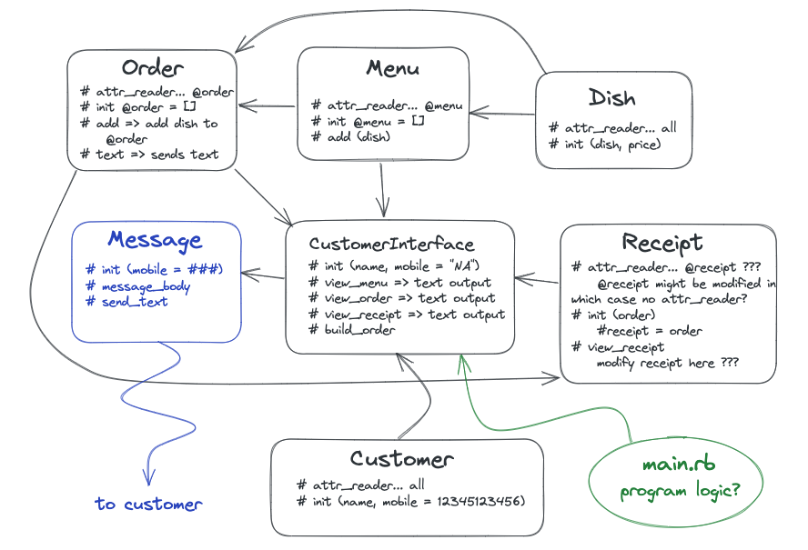
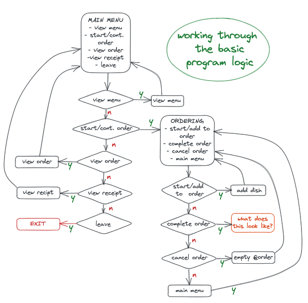
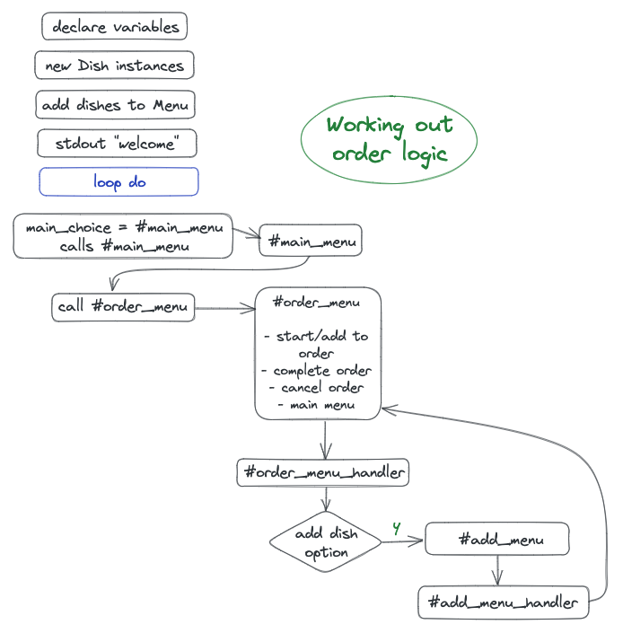
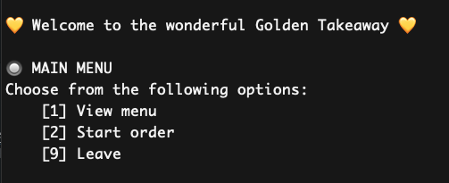
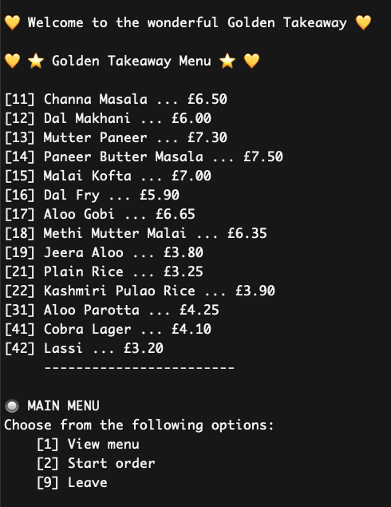
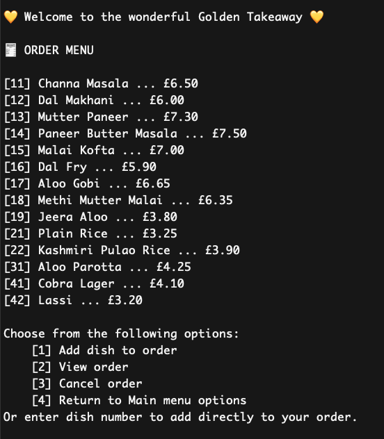
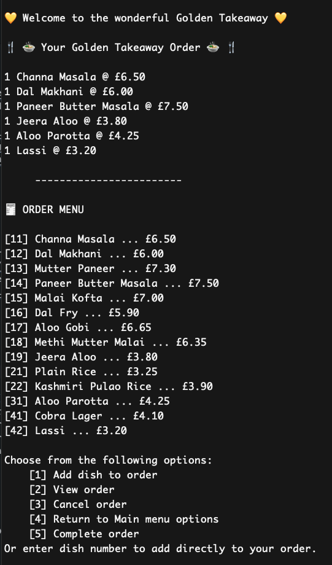
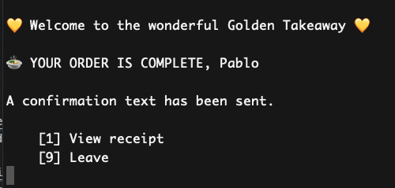

# golden-takeaway

Makers main course end of week 2 individual challenge. As such it is a very early project and shows a snapshot of my skills at that time.

[Getting started](#getting-started) | [Running tests](#running-tests) | [User stories](#user-stories) | [Project Design](#project-design) | [Partial Program Logic](#partial-program-logic) | [Partial Order Logic](#partial-order-logic) | [Example use](#example-use)

## Requirements of this project

Aside from Ruby, this app uses the following gems:
**dotenv** to store environment variables
To install dotenv, run `gem install dotenv`
**twilio-ruby** to send SMS messages
To install twilio-ruby, run `gem install twilio-ruby`

The file will not run without a .env file since it is required in the message.rb file. 
For the text message function to work, you will need to create a .env file in the root directory of the project and add the following environment variables to it:
```bash
TWILIO_ACCOUNT_SID=your_account_sid
TWILIO_AUTH_TOKEN=your_auth_token
TWILIO_PHONE_NUMBER=your_twilio_phone_number
```
Note 1: the twilio phone number must be in the format "+441234567890"
Note 2: twilio-ruby in this project uses a trial account and messages can only be sent to verified numbers. The number you want to send the message to must be verified in the twilio account.

## Getting Started

1. Clone this repo to your local machine.
2. Run `bundle install` to install the required gems.
3. Run `ruby lib/app.rb` to start the app in the terminal.

## Running tests

Run `rspec` to run the tests.

Brief:

## User stories

> As a customer  
> So that I can check if I want to order something  
> I would like to see a list of dishes with prices.
> 
> As a customer  
> So that I can order the meal I want  
> I would like to be able to select some number of several available dishes.
> 
> As a customer  
> So that I can verify that my order is correct  
> I would like to see an itemised receipt with a grand total.

Use the `twilio-ruby` gem to implement this next one. You will need to use
doubles too.

> As a customer  
> So that I am reassured that my order will be delivered on time  
> I would like to receive a text such as "Thank you! Your order was placed and
> will be delivered before 18:52" after I have ordered.

Fair warning: if you push your Twilio API Key to a public GitHub repository,
anyone will be able to see and use it. What are the security implications of
that? How will you keep that information out of your repository?

## Project Design



## Partial Program Logic



## Partial Order Logic



## Example use

The main app menu:



The dishes menu:



The order menu:



The current order:



A completed order with text confirmation:

