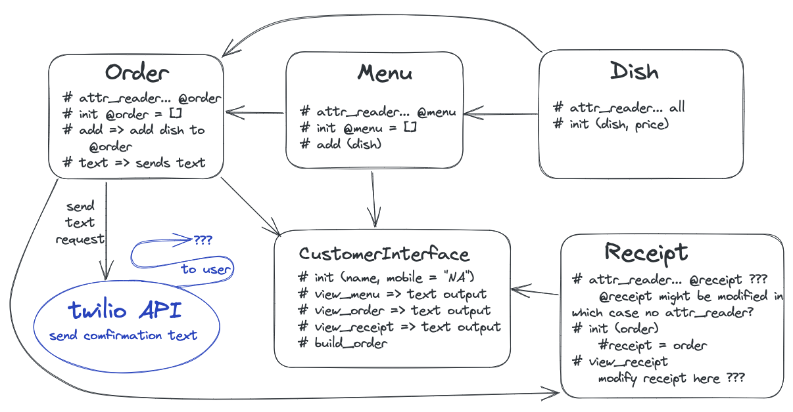

{{PROBLEM}} Golden Square Solo Takeaway Challenge planning

1. Describe the Problem

> As a customer
> So that I can check if I want to order something
> I would like to [see] a [list] of [dishes] with [prices].

> As a customer
> So that I can [order] the meal I want
> I would like to be able to [select] some [number] of several available [dishes].

> As a customer
> So that I can verify that my order is correct
> I would like to [see] an [itemised] [receipt] with a grand [total].

Use the twilio-ruby gem to implement this next one. You will need to use doubles too.

> As a customer
> So that I am reassured that my order will be delivered on time
> I would like to [receive] a [text] such as "Thank you! Your [order] was [placed] and will be [delivered] before 18:52" after I have ordered.

2. Design the Class System

## Integrated fuctionality to test
```ruby
# Menu .menu # returns an array with all Dish instances
# Order .order # returns an array with all ordered Dish instances
Order .text # sends a confimation text to the customer
# CustomerInterface .view_menu # outputs a user-friendly display of menu items
# CustomerInterface .view_order # outputs a user-friendly display of current order items
CustomerInterface .view_receipt # outputs a user-friendly display of the receipt
  # - all ordered items plus a total
CustomerInterface .build_order # i/o a user-friendly interface to add order items
Receipt .view_receipt # returns an array of ordered items
```

```ruby
class Dish
  attr_reader :dish, :price

  def initialize(dish, price)
    # init #variables
  end
end

class Menu
  attr_reader :menu

  def initialize 
    # @menu = []
  end

  def add(dish)
    # adds dish to @menu
  end
end

class Order
  attr_reader :order

  def initialize
    # @order = []
  end

  def add
    # add Dish instance to @order
  end
end

class CustomerInterface
  def initialize(name, mobile)
    # init #variables
  end

  def view_menu
    # stdout menu
  end

  def view_order
    # stdout order
  end

  def view_receipt
    # stdout receipt
  end

  def build_order
    # allows users to add items to their order
    # user can cancel order
    # user can complete order
  end
end

class Receipt
  def initialize(order)
    # @receipt = order
  end
end
```
1. Create Examples as Integration Tests


# EXAMPLE
> get menu with dishes => 
```ruby

```
4. Create Examples as Unit Tests
Create examples, where appropriate, of the behaviour of each relevant class at a more granular level of detail.

# EXAMPLE
```ruby

```
5. Implement the Behaviour
After each test you write, follow the test-driving process of red, green, refactor to implement the behaviour.
